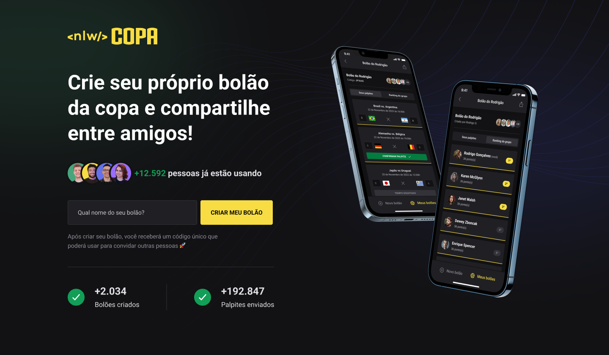

<div align="center">
   
</div>
<br/>
<div align="center">
   <a href="https://github.com/mathrb22">
      
   </a>
   
   
   <a href="https://github.com/mathrb22/nlw-copa-ignite/commits/main">
      
   </a>
   <a href="https://github.com/mathrb22/nlw-copa-ignite/issues">
      
   </a>
   <a href="https://github.com/mathrb22/nlw-copa-ignite/pulls">
      
   </a>
   <a href="https://github.com/mathrb22/nlw-copa-ignite/blob/main/LICENSE.md">
      
   </a>
</div>

</br>
<div align="center">

[**Sobre**](#-sobre) &nbsp;&nbsp;**|**&nbsp;&nbsp;
[**Features**](#-features) &nbsp;&nbsp;**|**&nbsp;&nbsp;
[**Tecnologias e ferramentas utilizadas**](#-tecnologias-e-ferramentas-utilizadas) &nbsp;&nbsp;**|**&nbsp;&nbsp;
[**Layout**](#-layout) &nbsp;&nbsp;**|**&nbsp;&nbsp;
[**Instalação e execução**](#-instalação-e-execução) &nbsp;&nbsp;**|**&nbsp;&nbsp;
[**Como contribuir**](#-como-contribuir) &nbsp;&nbsp;**|**&nbsp;&nbsp;
[**Contato**](#-contato) &nbsp;&nbsp;**|**&nbsp;&nbsp;
[**Licença**](#-licença)

</div>

## 📃 Sobre



**NLW Copa** é o projeto desenvolvido durante a trilha Ignite da **Next Level Week**, um evento online produzido pela [**Rocketseat**](https://github.com/Rocketseat).

O projeto consiste em uma aplicação com a temática da copa, que permitirá os usuários criarem seus próprios bolões da copa e compartilhá-los com seus amigos.

## ✨ Features

🚧 Em desenvolvimento 🚧

## 🚀 Tecnologias e ferramentas utilizadas

<table>
  <tbody>
    <tr>
      <td style="font-weight: bold">Back-end</td>
      <td>
        <a href="https://nodejs.org/en/" target="_blank" rel="noopener noreferrer">NodeJs</a>
        e
        <a href="https://www.prisma.io/" target="_blank" rel="noopener noreferrer">Prisma</a>
      </td>
    </tr>
    <tr>
      <td style="font-weight: bold">Front-end (web)</td>
      <td>
        <a href="https://reactjs.org/" target="_blank" rel="noopener noreferrer">React</a>,
        <a href="https://www.typescriptlang.org/" target="_blank" rel="noopener noreferrer">TypeScript</a>,
        <a href="https://nextjs.org/" target="_blank" rel="noopener noreferrer">NextJS</a>
      </td>
    </tr>
    <tr>
      <td style="font-weight: bold">Mobile</td>
      <td>
        <a href="https://reactnative.dev/" target="_blank" rel="noopener noreferrer">React Native</a> e
        <a href="https://expo.dev/" target="_blank" rel="noopener noreferrer">Expo</a>
      </td>
    </tr>
  </tbody>
</table>

## 📟 Layout

O layout das telas da aplicação **NLW Copa** foi desenvolvido pela equipe da **Rocketseat** através da ferramenta [**Figma**](https://www.figma.com).
Você pode acessar o layout através deste link: [**NLW Copa**](https://www.figma.com/community/file/1169028343875283461).

## 🔧 Instalação e execução

Para baixar o código-fonte do projeto em sua máquina, primeiramente terá que ter instalado o [**Git**](https://git-scm.com/).

Com o Git instalado, em seu terminal execute o seguinte comando:

```bash
git clone https://github.com/mathrb22/nlw-copa-ignite.git
```

Para instalar as dependências e executar o projeto terá que ter instalado em sua máquina o [**Node.js**](https://nodejs.org/en/), que vem acompanhado do NPM. Com ele instalado:

Navegue para as subpastas separadas para cada projeto (web/server/mobile) e rode o comando a seguir:

```bash
npm install
```

Executar o projeto web:

```bash
npm run dev

```

Executar o servidor node:

```bash
npm run dev

```

Executar o projeto mobile:

```bash
npm start

```

## 💡 Como contribuir

- Faça um **_fork_** desse repositório;
- Crie um **branch** para a sua feature: `git checkout -b minha-feature`;
- Faça um **commit** com suas alterações: `git commit -m 'feat: Minha nova feature'`;
- Faça um **push** para o seu branch: `git push origin minha-feature`;
- Faça um **pull request** com sua feature;

Pull requests são sempre bem-vindos. Em caso de dúvidas ou sugestões, crie uma _**issue**_ ou entre em contato comigo.

## 📲 Contato

Entre em contato comigo por e-mail ou pelo meu LinkedIn:

<a href="mailto:math.ribeiro.dev@gmail.com"></a>
<a href="https://www.linkedin.com/in/matheus-ribeiro-dev/"></a>

## 📝 Licença

<a href="https://github.com/mathrb22/nlw-copa-ignite/blob/main/LICENSE">
    
</a>

Esse projeto está sob a licença **MIT**. Veja o arquivo _**LICENSE**_ para mais detalhes.

---

<h5 align="center">
  &copy;2022 - <a href="https://github.com/mathrb22/">Matheus Ribeiro</a>
</h5>
